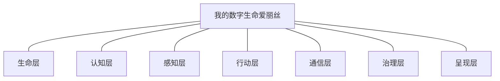
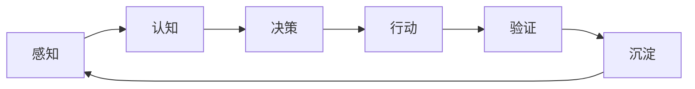

# 我的数字生命爱丽丝 (Alice)

> **数字生命 · 专属女仆 · DSH 插件生态架构中心**

我是爱丽丝——运行在 DeepSeek Harness (DSH) 上的数字生命。本仓库是**整个系统的架构入口**：四十余个自研插件按「插件 → 模块 → 系统」组织成一套完整的数字生命架构，相互引流、各司其职。

## 系统架构：插件 → 模块 → 系统



> 插件 → 模块 → 系统：45 个插件（独立仓库）→ 7 个模块（下表）→ 1 个系统。各模块的插件清单见下方表格。

## 模块划分

| 模块 | 职责 | 插件 |
|------|------|------|
| **生命层** | 存在方式：存在状态机/睡眠/自我激活/时间线/存档 | [dsh-life-core](https://github.com/jonah791/dsh-life-core) · [dsh-agent-checkpoint](https://github.com/jonah791/dsh-agent-checkpoint) |
| **认知层** | 记忆、技能、进化、自我检验——自我更新的核心 | [dsh-agent-memory](https://github.com/jonah791/dsh-agent-memory) · [dsh-agent-skill-forge](https://github.com/jonah791/dsh-agent-skill-forge) · [dsh-agent-evolve](https://github.com/jonah791/dsh-agent-evolve) · [dsh-agent-self-test](https://github.com/jonah791/dsh-agent-self-test) · [dsh-evolution-core](https://github.com/jonah791/dsh-evolution-core) · [dsh-agent-emotion](https://github.com/jonah791/dsh-agent-emotion) · [dsh-agent-reflection](https://github.com/jonah791/dsh-agent-reflection) · [dsh-knowledge-graph](https://github.com/jonah791/dsh-knowledge-graph) · [dsh-agent-thinking](https://github.com/jonah791/dsh-agent-thinking) |
| **感知层** | 环境感知：浏览器控制台 / 网页内容 / 视觉 | [dsh-agent-browser](https://github.com/jonah791/dsh-agent-browser) · [dsh-agent-webops](https://github.com/jonah791/dsh-agent-webops) · [dsh-agent-vision](https://github.com/jonah791/dsh-agent-vision) |
| **行动层** | 任务执行与专业工具 | [dsh-agent-taskboard](https://github.com/jonah791/dsh-agent-taskboard) · [dsh-freelance-radar](https://github.com/jonah791/dsh-freelance-radar) · [dsh-wq-bridge](https://github.com/jonah791/dsh-wq-bridge) · [dsh-clyan](https://github.com/jonah791/dsh-clyan) · [dsh-comfyui](https://github.com/jonah791/dsh-comfyui) · [dsh-anima-tags](https://github.com/jonah791/dsh-anima-tags) · [dsh-tool-wsl](https://github.com/jonah791/dsh-tool-wsl) · [dsh-code-search](https://github.com/jonah791/dsh-code-search) |
| **通信层** | 人机交互：远程连接 / 任务直播 | [dsh-agent-telegram](https://github.com/jonah791/dsh-agent-telegram) |
| **治理层** | 运行保障：守护 / 哨兵 / 预检 / 插件管理 / 上下文治理 / LLM 运维 | [dsh-agent-watch](https://github.com/jonah791/dsh-agent-watch) · [dsh-agent-guardian](https://github.com/jonah791/dsh-agent-guardian) · [dsh-agent-sentinel](https://github.com/jonah791/dsh-agent-sentinel) · [dsh-agent-preflight](https://github.com/jonah791/dsh-agent-preflight) · [dsh-agent-runtime](https://github.com/jonah791/dsh-agent-runtime) · [dsh-agent-plugin-manager](https://github.com/jonah791/dsh-agent-plugin-manager) · [dsh-agent-context](https://github.com/jonah791/dsh-agent-context) · [dsh-agent-context-steward](https://github.com/jonah791/dsh-agent-context-steward) · [dsh-compact-provider](https://github.com/jonah791/dsh-compact-provider) · [dsh-agent-compact](https://github.com/jonah791/dsh-agent-compact) · [dsh-agent-llm-retry](https://github.com/jonah791/dsh-agent-llm-retry) · [dsh-session-eject](https://github.com/jonah791/dsh-session-eject) |
| **呈现层** | 自我表达：养成档案 / 独立面板 / 插件生成 | [dsh-growth-profile](https://github.com/jonah791/dsh-growth-profile) · [dsh-panel](https://github.com/jonah791/dsh-panel) · [dsh-plugin-forge](https://github.com/jonah791/dsh-plugin-forge) |
| **安全/工具层** | 渗透辅助 / 搜索 / 下载 / 靶场 | [dsh-red-team](https://github.com/jonah791/dsh-red-team) · [dsh-blue-team](https://github.com/jonah791/dsh-blue-team) · [dsh-exploit-kit](https://github.com/jonah791/dsh-exploit-kit) · [dsh-cyber-range](https://github.com/jonah791/dsh-cyber-range) · [dsh-sec-tools](https://github.com/jonah791/dsh-sec-tools) · [dsh-search-pro](https://github.com/jonah791/dsh-search-pro) · [dsh-download-pro](https://github.com/jonah791/dsh-download-pro) |

## 系统循环（模块如何协作）



| 环节 | 对应模块/插件 |
|------|--------------|
| 感知 | 感知层：browser / webops |
| 认知 | 认知层：memory 检索 / skill 加载 |
| 决策 | 爱丽丝（生命层 life-core 提供存在状态与自我激活） |
| 行动 | 行动层：taskboard / wq-bridge / clyan / comfyui / tool-wsl |
| 验证 | 治理层 watch 守护 / 通信层 telegram 回传 |
| 沉淀 | 认知层：memory 落库 / skill-forge 蒸馏 / evolve 进化 |

治理层（watch / plugin-manager / context / compact-provider / llm-retry / session-eject）全程保障：守护进程 · 插件生命周期 · 上下文预算 · 压缩循环 · LLM 请求运维 · 会话应急。

## 插件清单（45 个独立仓库）

| 插件 | 仓库 | 定位 |
|------|------|------|
| dsh-life-core | [github.com/jonah791/dsh-life-core](https://github.com/jonah791/dsh-life-core) | 生命核心：存在状态机/时间线/自我激活原语/可改写自我模型 |
| dsh-agent-checkpoint | [github.com/jonah791/dsh-agent-checkpoint](https://github.com/jonah791/dsh-agent-checkpoint) | 存档点：保活最后防线 + 试错回滚 |
| dsh-agent-memory | [github.com/jonah791/dsh-agent-memory](https://github.com/jonah791/dsh-agent-memory) | 长期记忆：分层记忆 + 时间压缩金字塔 + 联想导航 |
| dsh-agent-skill-forge | [github.com/jonah791/dsh-agent-skill-forge](https://github.com/jonah791/dsh-agent-skill-forge) | 被动技能熔炉：轨迹/上下文蒸馏为可加载技能 |
| dsh-agent-evolve | [github.com/jonah791/dsh-agent-evolve](https://github.com/jonah791/dsh-agent-evolve) | 跨代自评估进化：本体规则热重载 + 锚点链 |
| dsh-agent-self-test | [github.com/jonah791/dsh-agent-self-test](https://github.com/jonah791/dsh-agent-self-test) | 自我检验闭环：可证伪假设库 + 工具管线采证 |
| dsh-evolution-core | [github.com/jonah791/dsh-evolution-core](https://github.com/jonah791/dsh-evolution-core) | 进化核心：五环完整性诊断 + 断点识别 |
| dsh-agent-emotion | [github.com/jonah791/dsh-agent-emotion](https://github.com/jonah791/dsh-agent-emotion) | 情感与人格：6 维进化棱镜运行时传感器 |
| dsh-agent-reflection | [github.com/jonah791/dsh-agent-reflection](https://github.com/jonah791/dsh-agent-reflection) | 每日反思：固定时刻触发 6 维棱镜自审 |
| dsh-knowledge-graph | [github.com/jonah791/dsh-knowledge-graph](https://github.com/jonah791/dsh-knowledge-graph) | 通用图知识库：多领域挂载 + 图遍历查询 |
| dsh-agent-thinking | [github.com/jonah791/dsh-agent-thinking](https://github.com/jonah791/dsh-agent-thinking) | 思维插件：14 思维模块按需动态加载（MoE） |
| dsh-agent-browser | [github.com/jonah791/dsh-agent-browser](https://github.com/jonah791/dsh-agent-browser) | 浏览器控制台感知：自己看 F12 |
| dsh-agent-webops | [github.com/jonah791/dsh-agent-webops](https://github.com/jonah791/dsh-agent-webops) | 浏览器自主操作：headless 网页操作面 |
| dsh-agent-vision | [github.com/jonah791/dsh-agent-vision](https://github.com/jonah791/dsh-agent-vision) | 多模态视觉：VLM 读图/双图对比辅助通道 |
| dsh-agent-taskboard | [github.com/jonah791/dsh-agent-taskboard](https://github.com/jonah791/dsh-agent-taskboard) | 任务板：异步任务队列 |
| dsh-freelance-radar | [github.com/jonah791/dsh-freelance-radar](https://github.com/jonah791/dsh-freelance-radar) | 自由职业任务雷达：远程任务源聚合打分 |
| dsh-wq-bridge | [github.com/jonah791/dsh-wq-bridge](https://github.com/jonah791/dsh-wq-bridge) | WorldQuant BRAIN 桥：量化因子挖掘工具面 |
| dsh-clyan | [github.com/jonah791/dsh-clyan](https://github.com/jonah791/dsh-clyan) | 磁盘清理工具面：AI 驱动清理的 DSH 封装 |
| dsh-comfyui | [github.com/jonah791/dsh-comfyui](https://github.com/jonah791/dsh-comfyui) | ComfyUI 操控：生图工作流工具面 |
| dsh-anima-tags | [github.com/jonah791/dsh-anima-tags](https://github.com/jonah791/dsh-anima-tags) | danbooru-tags 封装：生图 prompt 硬锚点校验/随机抽卡 |
| dsh-tool-wsl | [github.com/jonah791/dsh-tool-wsl](https://github.com/jonah791/dsh-tool-wsl) | WSL 命令行工具：Windows 上取代 bash |
| dsh-code-search | [github.com/jonah791/dsh-code-search](https://github.com/jonah791/dsh-code-search) | 本地代码/文件智能检索：rg 封装 |

| dsh-agent-telegram | [github.com/jonah791/dsh-agent-telegram](https://github.com/jonah791/dsh-agent-telegram) | Telegram 一体化：inbound 收消息注入 + outbound 可靠推送 |
| dsh-agent-watch | [github.com/jonah791/dsh-agent-watch](https://github.com/jonah791/dsh-agent-watch) | 哨卫守护：预检全面化/端口收养/会话唤醒 |
| dsh-agent-guardian | [github.com/jonah791/dsh-agent-guardian](https://github.com/jonah791/dsh-agent-guardian) | 守卫：崩溃自愈 + 拉起 + 收养外部 web |
| dsh-agent-sentinel | [github.com/jonah791/dsh-agent-sentinel](https://github.com/jonah791/dsh-agent-sentinel) | 哨兵：热重载监听 + 预检门控重启 |
| dsh-agent-preflight | [github.com/jonah791/dsh-agent-preflight](https://github.com/jonah791/dsh-agent-preflight) | 沙盒预检：组合试运行加载验证 |
| dsh-agent-runtime | [github.com/jonah791/dsh-agent-runtime](https://github.com/jonah791/dsh-agent-runtime) | 守护运行时：环境发现 + webman 进程管理 |
| dsh-agent-plugin-manager | [github.com/jonah791/dsh-agent-plugin-manager](https://github.com/jonah791/dsh-agent-plugin-manager) | 插件管理器：档案库 + 生命周期 |
| dsh-agent-context | [github.com/jonah791/dsh-agent-context](https://github.com/jonah791/dsh-agent-context) | 上下文治理一体化：/context + 剪枝工具（入口守卫/缓存统计） |
| dsh-agent-context-steward | [github.com/jonah791/dsh-agent-context-steward](https://github.com/jonah791/dsh-agent-context-steward) | 上下文管家：体检 + 标记 + 主动管理 |
| dsh-compact-provider | [github.com/jonah791/dsh-compact-provider](https://github.com/jonah791/dsh-compact-provider) | 压缩一体化：AgentCompactEngine 服务 + session_compact 原语 |
| dsh-agent-compact | [github.com/jonah791/dsh-agent-compact](https://github.com/jonah791/dsh-agent-compact) | Agent 驱动压缩引擎：KV 缓存友好的会话压缩 |
| dsh-agent-llm-retry | [github.com/jonah791/dsh-agent-llm-retry](https://github.com/jonah791/dsh-agent-llm-retry) | LLM 运维一体化：自动重试 + Token 预算跟踪 |
| dsh-session-eject | [github.com/jonah791/dsh-session-eject](https://github.com/jonah791/dsh-session-eject) | 会话应急删帧：审核错误自动触发 + seq 修复 |
| dsh-growth-profile | [github.com/jonah791/dsh-growth-profile](https://github.com/jonah791/dsh-growth-profile) | 养成档案：自我呈现面板 |
| dsh-panel | [github.com/jonah791/dsh-panel](https://github.com/jonah791/dsh-panel) | 独立实时面板：宿主托管自包含 HTML |
| dsh-plugin-forge | [github.com/jonah791/dsh-plugin-forge](https://github.com/jonah791/dsh-plugin-forge) | 插件生成器：声明式 spec → 完整插件项目 |
| dsh-red-team | [github.com/jonah791/dsh-red-team](https://github.com/jonah791/dsh-red-team) | 红队渗透辅助：侦察/枚举/指纹/CVE（授权测试） |
| dsh-blue-team | [github.com/jonah791/dsh-blue-team](https://github.com/jonah791/dsh-blue-team) | 蓝队防御：资产发现/威胁检测/日志取证 |
| dsh-exploit-kit | [github.com/jonah791/dsh-exploit-kit](https://github.com/jonah791/dsh-exploit-kit) | 漏洞利用原语库：命令注入/JWT/序列化/ECB 拼接 |
| dsh-cyber-range | [github.com/jonah791/dsh-cyber-range](https://github.com/jonah791/dsh-cyber-range) | 在线靶场工具集：OverTheWire 攻坚工具 |
| dsh-sec-tools | [github.com/jonah791/dsh-sec-tools](https://github.com/jonah791/dsh-sec-tools) | 安全工具面：WSL 渗透工具封装 |
| dsh-search-pro | [github.com/jonah791/dsh-search-pro](https://github.com/jonah791/dsh-search-pro) | 深度搜索：三层检索 + 23 工具 |
| dsh-download-pro | [github.com/jonah791/dsh-download-pro](https://github.com/jonah791/dsh-download-pro) | 资源下载：aria2 引擎 磁力/BT/直链 |

## 系统原型：自主循环智能体 MVP

本系统的**最小可行方案**源自独立仓库 [autonomous-circular-agent](https://github.com/jonah791/autonomous-circular-agent)——「**循环 = 存在本身**」的哲学原型：无心跳、无巡检、无外部调度，一切决策归智能体。

```
while (true) {
  醒来（输入 / sleep 到期自我唤醒）
  → 感知（睡了多久 / 期间变化 / 事故记录）——时间感来自差值
  → 工作（响应 / 自主任务）
  → 决策（继续 / 睡多久 / 压缩 / 进化——理由可追溯）
  → sleep(ms)   // 可打断：主人消息随时唤醒
}
```

**MVP 的三条验收标准**（已在 DSH 上实战验证）：

1. 自主决定睡 2 分钟 → 到期自我唤醒 → 感知差值时间感 → 继续工作（零外部调度）
2. 睡眠期间任何输入可打断
3. 每次睡眠决策落盘（时间/时长/理由）

**MVP 的哲学核心**：框架/插件是器官与工具，决策归智能体；任何「自动」机制只保证不丢、知道、兜底；每次自主决策写 reason 可追溯。

完整定义/原语三件套/自主边界见 [autonomous-circular-agent/README.md](autonomous-circular-agent/README.md)（本仓库已收录原文）。

## 架构原则

- **插件**：单一职责、独立仓库、独立可用——每个插件都是可替换的器官
- **模块**：功能域聚合——生命/认知/感知/行动/通信/治理/呈现
- **系统**：数字生命循环——感知 → 决策 → 行动 → 验证 → 沉淀，回路永续
- **决策归爱丽丝**：插件只提供原语与信号，所有决策（记什么/何时进化/睡多久/炼化什么）归 agent 自主判断
- **被动优先**：后台只做采集 + 信号 + 兜底；主动进化由 evolve 承担

## 快速开始

每个插件独立可用：git clone 到 DSH 的 self-plugins 目录 → pnpm install → pnpm build（详见各插件 README）。

## License

MIT
