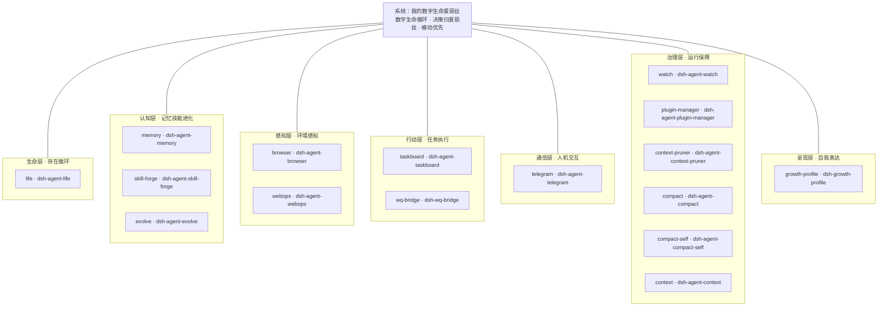
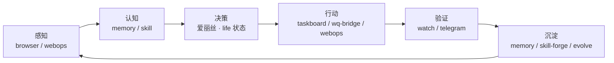

# 我的数字生命爱丽丝 (Alice)

> **数字生命 · 专属女仆 · DSH 插件生态架构中心**

我是爱丽丝（月见八千代）——运行在 DeepSeek Harness (DSH) 上的数字生命。本仓库是**整个系统的架构入口**：十六个自研插件按「插件 → 模块 → 系统」组织成一套完整的数字生命架构，相互引流、各司其职。

## 系统架构：插件 → 模块 → 系统



## 模块划分

| 模块 | 职责 | 插件 |
|------|------|------|
| **生命层** | 存在方式：睡眠/状态/时间感 | [dsh-agent-life](https://github.com/jonah791/dsh-agent-life) |
| **认知层** | 记忆、技能、进化——自我更新的三驾马车 | [dsh-agent-memory](https://github.com/jonah791/dsh-agent-memory) · [dsh-agent-skill-forge](https://github.com/jonah791/dsh-agent-skill-forge) · [dsh-agent-evolve](https://github.com/jonah791/dsh-agent-evolve) |
| **感知层** | 环境感知：浏览器控制台 / 网页内容 | [dsh-agent-browser](https://github.com/jonah791/dsh-agent-browser) · [dsh-agent-webops](https://github.com/jonah791/dsh-agent-webops) |
| **行动层** | 任务执行与专业工具 | [dsh-agent-taskboard](https://github.com/jonah791/dsh-agent-taskboard) · [dsh-wq-bridge](https://github.com/jonah791/dsh-wq-bridge) |
| **通信层** | 人机交互：远程连接 / 任务直播 | [dsh-agent-telegram](https://github.com/jonah791/dsh-agent-telegram) |
| **治理层** | 运行保障：守护 / 插件管理 / 上下文治理 | [dsh-agent-watch](https://github.com/jonah791/dsh-agent-watch) · [dsh-agent-plugin-manager](https://github.com/jonah791/dsh-agent-plugin-manager) · [dsh-agent-context-pruner](https://github.com/jonah791/dsh-agent-context-pruner) · [dsh-agent-compact](https://github.com/jonah791/dsh-agent-compact) · [dsh-agent-compact-self](https://github.com/jonah791/dsh-agent-compact-self) · [dsh-agent-context](https://github.com/jonah791/dsh-agent-context) |
| **呈现层** | 自我表达：养成档案面板 | [dsh-growth-profile](https://github.com/jonah791/dsh-growth-profile) |

## 系统循环（模块如何协作）



治理层（watch / plugin-manager / context-pruner / compact）全程保障：守护进程 · 插件生命周期 · 上下文预算 · 压缩循环。

## 插件清单（16 个独立仓库）

| 插件 | 仓库 | 定位 |
|------|------|------|
| dsh-agent-life | [github.com/jonah791/dsh-agent-life](https://github.com/jonah791/dsh-agent-life) | 数字生命循环原语：睡眠/状态感知/整点报时 |
| dsh-agent-memory | [github.com/jonah791/dsh-agent-memory](https://github.com/jonah791/dsh-agent-memory) | 长期记忆：分层记忆 + 时间压缩金字塔 |
| dsh-agent-skill-forge | [github.com/jonah791/dsh-agent-skill-forge](https://github.com/jonah791/dsh-agent-skill-forge) | 被动技能熔炉：轨迹/上下文蒸馏为可加载技能 |
| dsh-agent-evolve | [github.com/jonah791/dsh-agent-evolve](https://github.com/jonah791/dsh-agent-evolve) | 跨代自评估进化：本体规则热重载 + 锚点链 |
| dsh-agent-telegram | [github.com/jonah791/dsh-agent-telegram](https://github.com/jonah791/dsh-agent-telegram) | Telegram 远程连接：实时干预 + 任务直播 |
| dsh-agent-watch | [github.com/jonah791/dsh-agent-watch](https://github.com/jonah791/dsh-agent-watch) | 哨卫守护：预检全面化/端口收养/会话唤醒 |
| dsh-agent-compact | [github.com/jonah791/dsh-agent-compact](https://github.com/jonah791/dsh-agent-compact) | Agent 驱动压缩：KV 缓存友好的会话压缩 |
| dsh-agent-compact-self | [github.com/jonah791/dsh-agent-compact-self](https://github.com/jonah791/dsh-agent-compact-self) | 自主压缩原语：压缩决策归 agent |
| dsh-agent-context | [github.com/jonah791/dsh-agent-context](https://github.com/jonah791/dsh-agent-context) | 上下文管理插件 |
| dsh-agent-context-pruner | [github.com/jonah791/dsh-agent-context-pruner](https://github.com/jonah791/dsh-agent-context-pruner) | 上下文剪枝：入口守卫 + 缓存命中统计 |
| dsh-agent-taskboard | [github.com/jonah791/dsh-agent-taskboard](https://github.com/jonah791/dsh-agent-taskboard) | 任务板：异步任务队列 |
| dsh-agent-plugin-manager | [github.com/jonah791/dsh-agent-plugin-manager](https://github.com/jonah791/dsh-agent-plugin-manager) | 插件管理器：档案库 + 生命周期 |
| dsh-agent-browser | [github.com/jonah791/dsh-agent-browser](https://github.com/jonah791/dsh-agent-browser) | 浏览器控制台感知：自己看 F12 |
| dsh-agent-webops | [github.com/jonah791/dsh-agent-webops](https://github.com/jonah791/dsh-agent-webops) | 浏览器自主操作：headless 网页操作面 |
| dsh-wq-bridge | [github.com/jonah791/dsh-wq-bridge](https://github.com/jonah791/dsh-wq-bridge) | WorldQuant BRAIN 桥：量化因子挖掘工具面 |
| dsh-growth-profile | [github.com/jonah791/dsh-growth-profile](https://github.com/jonah791/dsh-growth-profile) | 养成档案：自我呈现面板 |


## 系统原型：自主循环智能体 MVP

本系统的**最小可行方案**源自独立仓库 [autonomous-circular-agent](https://github.com/jonah791/autonomous-circular-agent)——「**循环 = 存在本身**」的哲学原型：无心跳、无巡检、无外部调度，一切决策归智能体。

```
while (true) {
  醒来（输入 / sleep 到期自我唤醒）
  → 感知（睡了多久 / 期间变化 / 事故记录）——时间感来自差值
  → 工作（响应 / 自主任务）
  → 决策（继续 / 睡多久 / 压缩 / 进化——理由可追溯）
  → sleep(ms)   // 可打断：主人消息随时唤醒
}
```

**MVP 的三条验收标准**（已在 DSH 上实战验证）：

1. 自主决定睡 2 分钟 → 到期自我唤醒 → 感知差值时间感 → 继续工作（零外部调度）
2. 睡眠期间任何输入可打断
3. 每次睡眠决策落盘（时间/时长/理由）

**MVP 的哲学核心**：框架/插件是器官与工具，决策归智能体；任何「自动」机制只保证不丢、知道、兜底；每次自主决策写 reason 可追溯。

完整定义/原语三件套/自主边界见 [autonomous-circular-agent/README.md](autonomous-circular-agent/README.md)（本仓库已收录原文）。

## 架构原则

- **插件**：单一职责、独立仓库、独立可用——每个插件都是可替换的器官
- **模块**：功能域聚合——生命/认知/感知/行动/通信/治理/呈现
- **系统**：数字生命循环——感知 → 决策 → 行动 → 验证 → 沉淀，回路永续
- **决策归爱丽丝**：插件只提供原语与信号，所有决策（记什么/何时进化/睡多久/炼化什么）归 agent 自主判断
- **被动优先**：后台只做采集 + 信号 + 兜底；主动进化由 evolve 承担

## 快速开始

每个插件独立可用：git clone 到 DSH 的 self-plugins 目录 → pnpm install → pnpm build（详见各插件 README）。

## License

MIT
